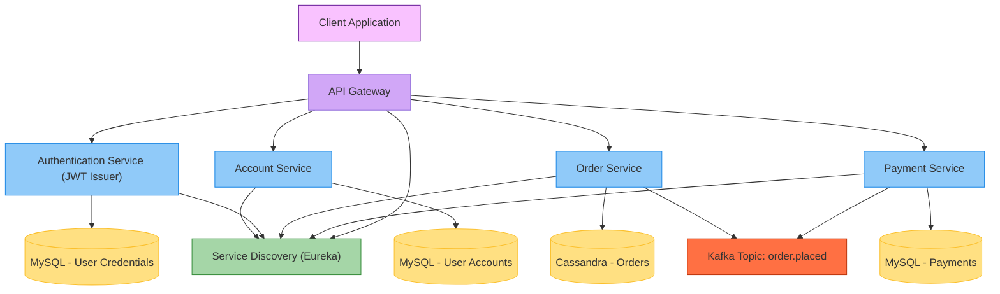

# SMall
**Author: M. Yang**

## Architectural Diagram

```mermaid
graph TD
    ClientApp[Client Application] --> APIGateway[API Gateway]

    APIGateway --> AuthService["Authentication Service (JWT Issuer)"]
    APIGateway --> AccountService[Account Service]
    APIGateway --> OrderService[Order Service]
    APIGateway --> PaymentService[Payment Service]
    
    AccountService --> MySQL_Accounts[(MySQL - User Accounts)]
    AuthService --> MySQL_Credentials[(MySQL - User Credentials)]
    OrderService --> CassandraOrders[(Cassandra - Orders)]
    PaymentService --> MySQL_Payments[(MySQL - Payments)]
    
    AccountService --> Eureka["Service Discovery (Eureka)"]
    AuthService --> Eureka
    OrderService --> Eureka
    PaymentService --> Eureka
    APIGateway --> Eureka
    
    OrderService --> Kafka[Kafka Topic: order.placed]
    PaymentService --> Kafka
    
    %% Define styles for different categories
    classDef clientApp fill:#f9c2ff,stroke:#6a1b9a;
    classDef apiGateway fill:#d1a7f7;
    classDef services fill:#90caf9,stroke:#1e88e5;
    classDef serviceDiscovery fill:#a5d6a7,stroke:#388e3c;
    classDef kafka fill:#ff7043,stroke:#bf360c;
    classDef databases fill:#ffe082,stroke:#fbc02d;
    
    %% Apply styles
    class ClientApp clientApp;
    class APIGateway apiGateway;
    class AuthService,AccountService,OrderService,PaymentService services;
    class Eureka serviceDiscovery;
    class Kafka kafka;
    class MySQL_Accounts,MySQL_Credentials,CassandraOrders,MySQL_Payments databases;
```
