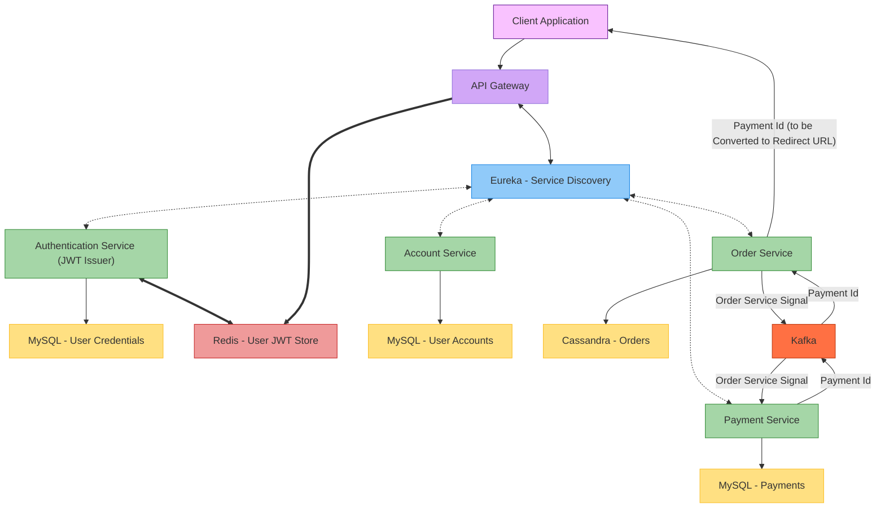

# SMall
**Author: M. Yang**

## Architectural Diagram



## Environment Variables
<details>
<summary>./.env</summary>

```
API_GATEWAY_PORT=
AUTH_SERVICE_PORT=
ACCOUNT_SERVICE_PORT=
ORDER_SERVICE_PORT=
PAYMENT_SERVICE_PORT=

EUREKA_PORT=8761

MYSQL_USER=
MYSQL_PWD=
MYSQL_PORT=
MYSQL_DB=s_mall

JWT_SECRET=must-be-a-Base64-encoded-secret

INTERNAL_AUTH_TOKEN=jwt-recommended
INTERNAL_AUTH_HEADER=

REDIS_PORT=6379
REDIS_PWD=

CASSANDRA_PORT=9042
CASSANDRA_USER=cassandra
CASSANDRA_PWD=
CASSANDRA_KEYSPACE=s_mall

ZOOKEEPER_PORT=2181

KAFKA_EXTERNAL_PORT=9092
KAFKA_INTERNAL_PORT=29092
KAFKA_CONSUMER_GROUP=order-payment-group
```
</details>

<details>
<summary>./auth-service/.env</summary>

```
JWT_EXP_MS=
```
</details>

## Run the App
### Option 1: Docker Compose for *All*
```shell
# docker compose --env-file .env up --build
$ docker compose up
```

### Option 2: IntelliJ IDEA for *Spring Boot Services*
Use IDEA's run button to run these. Use the **Services** panel (bottom left) to run them all at once.
- [docker-compose.yml](docker-compose.yml)
- [ServiceDiscoverer](service-discoverer/src/main/java/com/small/backend/servicediscoverer/ServiceDiscovererApplication.java)
- [ApiGatewayApplication](api-gateway/src/main/java/com/small/backend/apigateway/ApiGatewayApplication.java)
- [AccountServiceApplication](account-service/src/main/java/com/small/backend/accountservice/AccountServiceApplication.java)
- [AuthServiceApplication](auth-service/src/main/java/com/small/backend/authservice/AuthServiceApplication.java)
- [PaymentServiceApplication](payment-service/src/main/java/com/small/backend/paymentservice/PaymentServiceApplication.java)
- [OrderServiceApplication](order-service/src/main/java/com/small/backend/orderservice/OrderServiceApplication.java)

Order **matters**.
**Some services** (e.g., Eureka, API gateway) and the **Cassandra** database must be fully ready before other services can communicate with them.

### Option 3: Terminal for *Spring Boot Services*
The app can also be run from the terminal if IDEA is not available. **Windows users** need to use **Git Bash**.
```shell
# project's root directory
# Cassandra may take around 5 minutes to boot
$ docker compose up
```

```shell
# in common/
# this runs mvn clean install for common
# without this, service modules like /auth-service won't compile
# don't use `$ . run.sh` because it can close the current shell immediately upon exit (nothing can be observed)
$ ./run.sh
```

```shell
# in service-discover/, api-gateway/, /auth-service, etc.
# Start service-discover first.
# don't use `$ . run.sh` because it can close the current shell immediately upon exit (nothing can be observed)
$ ./run.sh
```

## REST APIs for Postman

It's **recommended** to set these variables **in Postman Environments** to reuse them more easily (single point of control).

|        Variable        |    Type    |               Current Value               |
|:----------------------:|:----------:|:-----------------------------------------:|
|     `api-gateway`      |  default   |  as in [./.env](#environment-variables)   |
| `internal-auth-header` |  default   |  as in [./.env](#environment-variables)   |
|    `internal-token`    | **secret** |  as in [./.env](#environment-variables)   |
|    `order-service`     |  default   |  as in [./.env](#environment-variables)   |

**Note:** `order-service` should **not** be exposed outside Docker network in production. However, in this project,
we'll call the _Complete Order_ endpoint of `order-service` from `localhost` to **simulate an internal call** by
`delivery-service` that's not implemented.


### Authentication Service
<details>
<summary>Register</summary>

```http request
# No Auth
POST {{api-gateway}}/api/v1/auth/register
```
```json5
// Example Request Body
{
    "email": "barry@allen.com",
    "username": "flash",
    "password": "speedforce99",
    "shippingAddress": "300 Central City Blvd.",
    "billingAddress": "301 Lightning Dr."
}
```
</details>

<details>
<summary>Login</summary>

```http request
# No Auth
POST {{api-gateway}}/api/v1/auth/login
```
```json5
// Example Request Body
{
  "email": "barry@allen.com",
  "password": "speedforce99"
}
```
</details>

<details>
<summary>Update Password</summary>

```http request
# Authorization: Bearer <JWT-Generated-by-Login>
PUT {{api_gateway}}/api/v1/auth/password
```
```json5
// Example Request Body
{
  "newPassword": "speedforce99!"
}
```
</details>

<details>
<summary>Logout</summary>

```http request
# Authorization: Bearer <JWT-Generated-by-Login>
POST {{api_gateway}}/api/v1/auth/logout
```
</details>


### Account Service

<details>
<summary>Get Account by Email</summary>

```http request
# Authorization: Bearer <JWT-Generated-by-Login>
GET {{api_gateway}}/api/v1/accounts/email/barry@allen.com
```
</details>

<details>
<summary>Get Account by ID</summary>

```http request
# Authorization: Bearer <JWT-Generated-by-Login>
GET {{api_gateway}}/api/v1/accounts/4c1f697b-95c5-4921-a639-3d718ed1aa3b
```
</details>

<details>
<summary>Update Account</summary>

```http request
# Authorization: Bearer <JWT-Generated-by-Login>
PUT {{api_gateway}}/api/v1/accounts/4c1f697b-95c5-4921-a639-3d718ed1aa3b
```
```json5
// Example Request Body
{
  "username": "flash",
  "shippingAddress": "600 Velocity Ln.",
  "billingAddress": "610 Speedster Ave."
}
```
</details>


### Order Service
<details>
<summary>New Order</summary>

A payment is created along with the new order. The payment service returns the payment ID to the order service, and it
forwards the payment ID to the (assumed) frontend, which creates a **redirect** URL with it.

```http request
# Authorization: Bearer <JWT-Generated-by-Login>
POST {{api_gateway}}/api/v1/orders
```
```json5
// Example Request Body
{
  "shippingAddress": "123 Main Street, Springfield, IL 62704",
  "items": [
    {
      "itemId": "d3b07384-d9a0-4f5f-a4a2-e3c0cfdba6e1",
      "itemName": "Wireless Mouse",
      "quantity": 2,
      "unitPrice": 19.99,
      "merchantId": "7f9c7e42-f3e5-4e60-9eb6-3df9b17dd3a3"
    },
    {
      "itemId": "9b74c989-6c5d-49c3-9c12-841f4d7f189e",
      "itemName": "Mechanical Keyboard",
      "quantity": 1,
      "unitPrice": 89.50,
      "merchantId": "ae2c7b66-4a1a-4b59-b690-ecc8043fd7f5"
    },
    {
      "itemId": "f8d0f8bd-1d61-4e37-b2f5-f601af179527",
      "itemName": "Laptop Stand",
      "quantity": 3,
      "unitPrice": 29.99,
      "merchantId": "03d89e8d-f77e-4602-b9c6-49084f16e888"
    }
  ]
}
```
</details>

<details>
<summary>Get Orders</summary>

```http request
# Authorization: Bearer <JWT-Generated-by-Login>
GET {{api_gateway}}/api/v1/orders
```
</details>

<details>
<summary>Get Order</summary>

```http request
# Authorization: Bearer <JWT-Generated-by-Login>
GET {{api_gateway}}/api/v1/orders/4bdab092-0d6a-4242-aa8a-f0cd32fe5d38
```
</details>

<details>
<summary>Complete Order</summary>

A call from `localhost` to **simulate** internal REST API call by `delivery-service` that's not implemented.

Pay attention to the special HTTP **header** `{{internal-auth-header}}` and the **base URL** `{{order-service}}`.

```http request
# {{internal-auth-header}}: {{internal-token}}
# No bearer token needed (internal communication).
POST {{order-service}}/orders/4bdab092-0d6a-4242-aa8a-f0cd32fe5d38/complete?userEmail=barry@allen.com
```
</details>

<details>
<summary>Cancel Order</summary>

```http request
# Authorization: Bearer <JWT-Generated-by-Login>
POST {{api_gateway}}/api/v1/orders/e91fdbb6-86dc-47ee-a7ed-b09d9cdd6dd5/cancel
```
</details>

<details>
<summary>Partial Refund Request 1</summary>

```http request
# Authorization: Bearer <JWT-Generated-by-Login>
POST {{api_gateway}}/api/v1/orders/4bdab092-0d6a-4242-aa8a-f0cd32fe5d38/refund
```
```json5
// Example Request Body
{
  "items": {
    "d3b07384-d9a0-4f5f-a4a2-e3c0cfdba6e1": 2,
    "f8d0f8bd-1d61-4e37-b2f5-f601af179527": 3
  }
}
```
</details>

<details>
<summary>Partial Refund Request 2</summary>

```http request
# Authorization: Bearer <JWT-Generated-by-Login>
POST {{api_gateway}}/api/v1/orders/4bdab092-0d6a-4242-aa8a-f0cd32fe5d38/refund
```
```json5
// Example Request Body
{
  "items": {
    "9b74c989-6c5d-49c3-9c12-841f4d7f189e": 1
  }
}
```
</details>

**Notes:**
- [Item assumptions](https://github.com/EricYoung37/sMall/issues/9).
- The two refund requests can be made in any order, and can also be combined into one.


### Payment Service
<details>
<summary>Get Payment by Payment ID</summary>

This will be a **redirect** request made by the (assumed) frontend using the payment ID returned from order creation.
The redirect page of the frontend will display a button that calls the _Submit Payment_ endpoint.

```http request
# Authorization: Bearer <JWT-Generated-by-Login>
GET {{api_gateway}}/api/v1/payments/42bb7c3a-194c-4e44-81ca-713d92fe1a74
```
</details>

<details>
<summary>Submit Payment</summary>

```http request
# Authorization: Bearer <JWT-Generated-by-Login>
POST {{api_gateway}}/api/v1/payments/24d4ee69-db2c-43e5-97c4-b3321b479e05/submit
```
```json5
// Example Request Body
{
  "paymentMethod": "PAYPAL"
}
```
</details>

<details>
<summary>Get Payment by Order ID</summary>

For regular payment review.

```http request
# Authorization: Bearer <JWT-Generated-by-Login>
GET {{api_gateway}}/api/v1/payments?orderId=4bdab092-0d6a-4242-aa8a-f0cd32fe5d38
```
</details>


## Helpful Commands

### Docker

After rebuilding an image with `docker compose up --build`, the old version becomes `<none>` (dangling).

Clean them up with:
```shell
# List dangling images
$ docker images -f dangling=true

# Prune dangling images
$ docker image prune
```

### Cassandra

These commands may be issued in the Docker container's shell.

```
-- Log in to Cassandra with the specified username and password
cqlsh -u cassandra -p $CASSANDRA_PASSWORD

-- Show all keyspaces in the cluster
DESCRIBE KEYSPACES;

-- Show all tables in keyspace `s_mall`
USE s_mall;
DESCRIBE orders;

-- Select the first 5 records from `orders`
SELECT * FROM orders LIMIT 5;

-- Clear all records from `orders`
TRUNCATE orders;
```

### MySQL

These commands may be issued in the Docker container's shell.

```
-- Log in to MySQL with username `user` and a password variable
mysql -u user -p $MYSQL_PASSWORD

-- Show all databases
SHOW DATABASES;

-- Select the `s_mall` database for use
USE s_mall;

-- Show all tables in the selected database
SHOW TABLES;

-- Select the first 5 records from `payments`
SELECT * FROM payments LIMIT 5;

-- Clear `payments`
-- This will reset all the auto incremental fields
TRUNCATE TABLE payments;

-- Clear `payments` but no reset
DELETE FROM payments;
```

### Windows Port Permissions
If this issue occurs when running a container
```
An attempt was made to access a socket in a way forbidden by its access permissions
```

Run Command Prompt or PowerShell as administrator and issue the commands below
```
net stop winnat
net start winnat
```