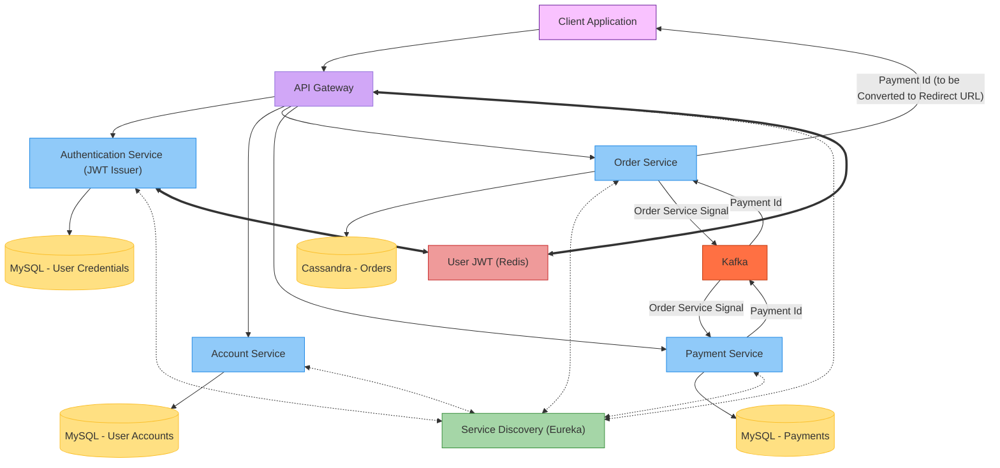

# SMall
**Author: M. Yang**

## Architectural Diagram



## Environment Variables
<details>
<summary>.env</summary>

```
API_GATEWAY_PORT=
AUTH_SERVICE_PORT=
ACCOUNT_SERVICE_PORT=
ORDER_SERVICE_PORT=
PAYMENT_SERVICE_PORT=

EUREKA_PORT=8761

MYSQL_USER=
MYSQL_PWD=
MYSQL_PORT=
MYSQL_DB=s_mall

JWT_SECRET=must-be-a-Base64-encoded-secret

INTERNAL_AUTH_TOKEN=jwt-recommended
INTERNAL_AUTH_HEADER=

REDIS_PORT=6379
REDIS_HOST=
REDIS_PWD=

CASSANDRA_PORT=9042
CASSANDRA_USER=cassandra
CASSANDRA_PWD=
CASSANDRA_KEYSPACE=s_mall

ZOOKEEPER_PORT=2181

KAFKA_EXTERNAL_PORT=9092
KAFKA_INTERNAL_PORT=29092
KAFKA_CONSUMER_GROUP=order-payment-group
```
</details>

<details>
<summary>./auth-service/.env</summary>

```
JWT_EXP_MS=
```
</details>


## Run the App
### IntelliJ IDEA
Use IDEA's run button to run these. Use the **Services** panel (bottom left) to run them all at once.
- [docker-compose.yml](docker-compose.yml)
- [ServiceDiscoverer](service-discoverer/src/main/java/com/small/backend/servicediscoverer/ServiceDiscovererApplication.java)
- [ApiGatewayApplication](api-gateway/src/main/java/com/small/backend/apigateway/ApiGatewayApplication.java)
- [AccountServiceApplication](account-service/src/main/java/com/small/backend/accountservice/AccountServiceApplication.java)
- [AuthServiceApplication](auth-service/src/main/java/com/small/backend/authservice/AuthServiceApplication.java)

Order **matters**. Service discoverer must be fully ready before other services can communicate.

### Terminal
The app can also be run from the terminal if IDEA is not available. **Windows users** need to use **Git Bash**.
```shell
# project's root directory
# Cassandra may take around 5 minutes to boot
$ docker compose up
```

```shell
# in common/
# this runs mvn clean install for common
# without this, service modules like /auth-service won't compile
# don't use `$ . run.sh` because it can close the current shell immediately upon exit (nothing can be observed)
$ ./run.sh
```

```shell
# in service-discover/, api-gateway/, /auth-service, etc.
# Start service-discover first.
# don't use `$ . run.sh` because it can close the current shell immediately upon exit (nothing can be observed)
$ ./run.sh
```

## Helpful Commands
### Windows Port Access Denied
If this issue occurs when running a container
```
An attempt was made to access a socket in a way forbidden by its access permissions
```

Run Command Prompt or PowerShell as administrator and issue the commands below
```
net stop winnat
net start winnat
```

### Cassandra
```
-- Log in to Cassandra with the specified username and password
cqlsh -u cassandra -p $CASSANDRA_PASSWORD

-- Show all keyspaces in the cluster
DESCRIBE KEYSPACES;

-- Show all tables in keyspace `s_mall`
USE s_mall;
DESCRIBE orders;

-- Select the first 5 records from `orders`
SELECT * FROM orders LIMIT 5;

-- Clear all records from `orders`
TRUNCATE orders;
```

### MySQL
```
-- Log in to MySQL with username `user` and a password variable
mysql -u user -p $MYSQL_PASSWORD

-- Show all databases
SHOW DATABASES;

-- Select the `s_mall` database for use
USE s_mall;

-- Show all tables in the selected database
SHOW TABLES;

-- Select the first 5 records from `payments`
SELECT * FROM payments LIMIT 5;
```